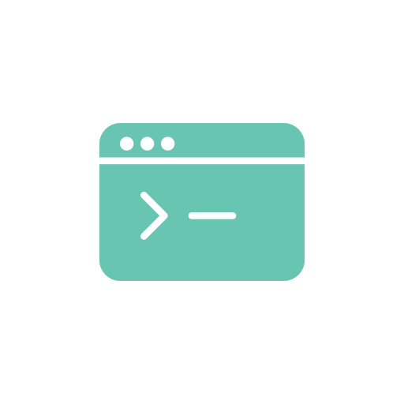

<!-- Improved compatibility of back to top link: See: https://github.com/othneildrew/Best-README-Template/pull/73 -->
<a name="readme-top"></a>
<!--
*** Thanks for checking out the Best-README-Template. If you have a suggestion
*** that would make this better, please fork the repo and create a pull request
*** or simply open an issue with the tag "enhancement".
*** Don't forget to give the project a star!
*** Thanks again! Now go create something AMAZING! :D
-->


<!-- PROJECT SHIELDS -->
<!--
*** I'm using markdown "reference style" links for readability.
*** Reference links are enclosed in brackets [ ] instead of parentheses ( ).
*** See the bottom of this document for the declaration of the reference variables
*** for contributors-url, forks-url, etc. This is an optional, concise syntax you may use.
*** https://www.markdownguide.org/basic-syntax/#reference-style-links
-->
<!--
[![Contributors][contributors-shield]][contributors-url]
[![Forks][forks-shield]][forks-url]
[![Stargazers][stars-shield]][stars-url]
[![Issues][issues-shield]][issues-url]
[![MIT License][license-shield]][license-url]
[![LinkedIn][linkedin-shield]][linkedin-url]
I guess I will enable this if there is any activity
-->


<!-- PROJECT LOGO -->
<br />
<div align="center">
  <a href="https://github.com/JavierNIS/Scripts">
    
  </a>

<h3 align="center">Scripts</h3>

  <p align="center">
    A place where I will post scripts that I have made that I might find interesting to share!
    <br />
    <a href="https://github.com/JavierNIS/Scripts"><strong>Explore the docs: »</strong></a>
    <br />
    <br />
    <a href="https://github.com/JavierNIS/Scripts">View Demo</a>
    ·
    <a href="https://github.com/JavierNIS/Scripts/issues">Report Bug.</a>
    ·
    <a href="https://github.com/JavierNIS/Scripts/issues">Request Feature.</a>
  </p>
</div>


<!-- TABLE OF CONTENTS -->
<details>
  <summary>Table of Contents</summary>
  <ol>
    <li>
      <a href="#about-the-project">About The Project</a>
      <ul>
        <li><a href="#built-with">Built With</a></li>
      </ul>
    </li>
    <li>
      <a href="#getting-started">Getting Started</a>
      <ul>
        <li><a href="#prerequisites">Prerequisites</a></li>
        <li><a href="#installation">Installation</a></li>
      </ul>
    </li>
    <li><a href="#usage">Usage</a></li>
    <li><a href="#roadmap">Roadmap</a></li>
    <li><a href="#contributing">Contributing</a></li>
    <li><a href="#license">License</a></li>
    <li><a href="#contact">Contact</a></li>
    <li><a href="#acknowledgments">Acknowledgments</a></li>
  </ol>
</details>


<!-- ABOUT THE PROJECT -->
## About The Project

The idea behind this repository is to publish scripts I have been making and uptdating. Some scripts are made out of curiosity, I just think about a pontetial use for a bash script and then I try to implement it. Other scripts are made out of necessity, sometimes, I want to make a process automatic and I make a simple script, said script then gets refactored and I try to make it usable for more situations. At the end, I have a somewhat big script that I want to share with the world, in case someone finds it useful!

What are the principles that I am following?:
* Modularity: I will try to break my projects into smaller functions, right now there isn't a lot to work with, but when I find it useful, I will try to combine common functions into libraries.
* Portability: I will try to keep the number of files needed for the usage of a script as small as possible, the best scenario will be to use only one or two files.
* Readability: Documentation should be something really important, I will try to add as many explanations as I redeem necessary. This is also implied for the coding, I am not a bash expert, but I will try to make code as readable as possible.
* INCLUDE YOUR OWN: This is a space to share your own bash code, if you have something that you find interesting then feel free to include it, also, feel free to criticise my work and propose ways to improve it, this is a place that promotes learning and improvement.

<p align="right">(<a href="#readme-top">back to top</a>)</p>


### Built With

* [![Next][Bash.sh]][Next-url]

>[!NOTE]
>You can use any scripting language, I will use bash, but I plan on learning others as time goes on. Other scripting languages will be added as they get used.

### List of scripts
<!-- A humble start -->
+ Bash:
  * Making_Makefiles

<p align="right">(<a href="#readme-top">back to top</a>)</p>


<!-- GETTING STARTED -->
## Getting Started

At the moment, due to the simplicity of the directory, you don't need to do a lot, there are no prerequesites.
<!--
### Prerequisites

This is an example of how to list things you need to use the software and how to install them.
* npm
  ```sh
  npm install npm@latest -g
  ```
-->
### Installation

1. Clone the repo
   ```sh
   git clone https://github.com/JavierNIS/Scripts.git
   ```

Prerequisites and the Installation might be changed as the repository grows bigger.

<p align="right">(<a href="#readme-top">back to top</a>)</p>


<!-- USAGE EXAMPLES -->
## Usage

This space will show you some examples on the usage of the scripts that will be shared in the repository:

### Making_Makefiles

<div align="center">
  <a href="https://github.com/JavierNIS/Scripts">
    
  </a>

If you want to create multiple projects from the ground (targetn doesn't exist in the current path) use this command.

>./Making_Makefiles --force target1 target2 target3 ... targetn

Do you want to make a dynamic library out of a single templated source file? Use this command.

>./Making_Makefiles -SX tpp --single --library=dynamic target ... targetn

Make a static library that has header files with the hpp extension and templated source files.

>./Making_Makefiles -ISX hpp tpp --library=static target1 target2 ... targetn

The makefile made will use ./targetn/inc as the include path for the header files.

>./Making_Makefiles -I inc target1 target2 ... targetn

You can combine most commands, for more help, use the the command

>./Making_Makefiles --help

<p align="right">(<a href="#readme-top">back to top</a>)</p>


<!-- ROADMAP -->
## Roadmap

### Making_Makefiles

- [ ] {IMMEDIATE} Fix potential bugs.
- [ ] Make it an option to make different target types within the same command.
- [ ] Make a command so you can handle multiple executables within the same target.
- [ ] Add support for other languages.
    - [ ] Support for pure C projects.
- [ ] Add other options like cmake or json tasks.

See the [open issues](https://github.com/JavierNIS/Scripts/issues) for a full list of proposed features (and known issues).

<p align="right">(<a href="#readme-top">back to top</a>)</p>


<!-- CONTRIBUTING -->
## Contributing

Contributions you make are **greatly appreciated**. This is where the contributors will be added.

If you have a suggestion that would make this better, please fork the repo and create a pull request. You can also simply open an issue with the tag "enhancement".
Don't forget to give the project a star! Thanks again!

1. Fork the Project
<!--2. Create your Feature Branch (`git checkout -b feature/AmazingFeature`)-->
2. Commit your Changes (`git commit -m 'Changes to nScript'`)
3. Push to the working Branch (`git push origin `)
4. Open a Pull Request

<p align="right">(<a href="#readme-top">back to top</a>)</p>


<!-- LICENSE -->
## License

This README is distributed under the MIT License. See `LICENSE.txt` for more information. The whole repository is also governed unde this License

<p align="right">(<a href="#readme-top">back to top</a>)</p>


<!-- CONTACT -->
## Contact

Javier Niño Sánchez - javierni.sanchez@gmail.com

Scripts: [https://github.com/JavierNIS/Scripts](https://github.com/JavierNIS/Scripts)

<p align="right">(<a href="#readme-top">back to top</a>)</p>


<!-- ACKNOWLEDGMENTS
## Acknowledgments

* []()
* []()
* []()

<p align="right">(<a href="#readme-top">back to top</a>)</p>

-->

<!-- MARKDOWN LINKS & IMAGES -->
<!-- https://www.markdownguide.org/basic-syntax/#reference-style-links -->
[contributors-shield]: https://img.shields.io/github/contributors/github_username/repo_name.svg?style=for-the-badge
[contributors-url]: https://github.com/github_username/repo_name/graphs/contributors
[forks-shield]: https://img.shields.io/github/forks/github_username/repo_name.svg?style=for-the-badge
[forks-url]: https://github.com/github_username/repo_name/network/members
[stars-shield]: https://img.shields.io/github/stars/github_username/repo_name.svg?style=for-the-badge
[stars-url]: https://github.com/github_username/repo_name/stargazers
[issues-shield]: https://img.shields.io/github/issues/github_username/repo_name.svg?style=for-the-badge
[issues-url]: https://github.com/github_username/repo_name/issues
[license-shield]: https://img.shields.io/github/license/github_username/repo_name.svg?style=for-the-badge
[license-url]: https://github.com/github_username/repo_name/blob/master/LICENSE.txt
[linkedin-shield]: https://img.shields.io/badge/-LinkedIn-black.svg?style=for-the-badge&logo=linkedin&colorB=555
[linkedin-url]: https://linkedin.com/in/linkedin_username
[product-screenshot]: images/screenshot.png
[bash.sh]: https://cdn3.brettterpstra.com/uploads/2015/02/terminal-longshadow.png
[Vue-url]: https://vuejs.org/
[Angular.io]: https://img.shields.io/badge/Angular-DD0031?style=for-the-badge&logo=angular&logoColor=white
[Angular-url]: https://angular.io/
[Svelte.dev]: https://img.shields.io/badge/Svelte-4A4A55?style=for-the-badge&logo=svelte&logoColor=FF3E00
[Svelte-url]: https://svelte.dev/
[Laravel.com]: https://img.shields.io/badge/Laravel-FF2D20?style=for-the-badge&logo=laravel&logoColor=white
[Laravel-url]: https://laravel.com
[Bootstrap.com]: https://img.shields.io/badge/Bootstrap-563D7C?style=for-the-badge&logo=bootstrap&logoColor=white
[Bootstrap-url]: https://getbootstrap.com
[JQuery.com]: https://img.shields.io/badge/jQuery-0769AD?style=for-the-badge&logo=jquery&logoColor=white
[JQuery-url]: https://jquery.com 
